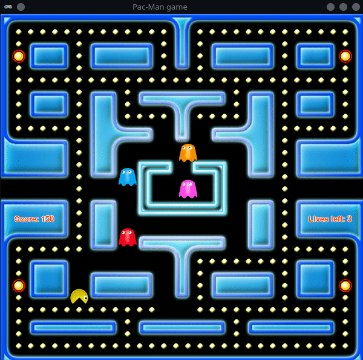

# :robot: Razvoj heurističkih algoritama za igranje igre *Pac-Man*

## Opis igre:

- Nakon što je je igra **Pac-Man** objavljena krajem 20. veka, postala je jedna od najpopularnijih igara svih vremena. 

- To je igra lavirinta, u kojoj je cilj da igrač pojede svu hranu koja se nalazi u zatvorenom lavirintu po kom se igrač kreće, u čemu ga sputavaju šareni duhovi koji ga jure. Ukoliko ga neki duh stigne, igrač gubi život, a ukupno ima samo tri života. 

- Lavirint ima otvore sa leve i desne strane koji omogućavaju da se igrač, ukoliko tuda prođe, teleportuje na drugu stranu i pobegne duhovima koji ga tuda ne mogu pratiti.

- Igra se završava pobedom ukoliko igrač pojede svu hranu, ili porazom ukoliko izgubi sve živote. 

- Igrač se može kretati na četiri strane po lavirintu (gore, dole, levo, desno), sa tim da je ograničen zidovima koji ga okružuju. U svakom ćošku lavirinta postoji po jedna velika, energetska hrana. Kada igrač nju pojede, duhovi postaju plavi i igrač ih tada može pojesti, pri čemu olakšava sebi igru i dobija više poena.

- Cilj projekta bio je razvoj algoritama veštačke inteligencije za kretanje duhova i igrača.

- Za više informacija o projektu pogledati *dokumentacija.pdf*.

## :hammer: Pokretanje:

- git clone https://github.com/popovic-olivera/computational-intelligence-project.git
- cd computational-intelligence-project
- python3 -m pip install --user virtualenv
- python3 -m venv venv
- source venv/bin/activate
- curl -sSL https://raw.githubusercontent.com/python-poetry/poetry/master/get-poetry.py | python
- source $HOME/.poetry/env (za proveru da li je poetry uspešno instaliran probati: poetry -- version)
- poetry install 
- cd src
- python gui.py

## Autori:

- Olivera Popović 64/2016,  [popovic-olivera](https://github.com/popovic-olivera)
- Nevena Ajvaz 289/2015,  [ajvaznevena](https://https://github.com/ajvaznevena)
