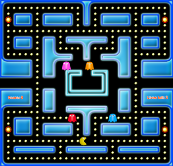
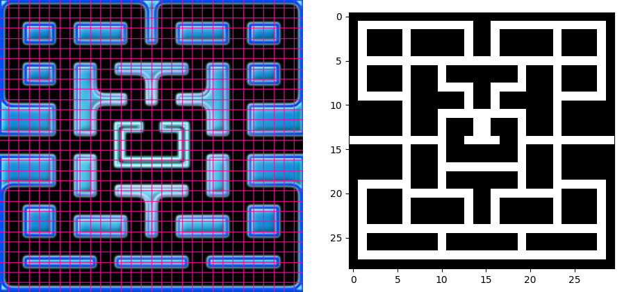
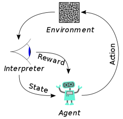

\newpage{} 

# Razvoj heurističkih algoritana za igranje igre *Pac-Man*

## 1. Uvod

Nakon što je je igra **Pac-Man** objavljena krajem 20. veka, postala je jedna od najpopularnijih igara svih vremena na celom svetu. To je igra lavirinta, u kojoj je cilj da igrač pojede svu hranu koja se nalazi u zatvorenom lavirintu po kom se igrač kreće, u čemu ga sputavaju šareni duhovi koji ga jure. Ukoliko ga neki duh stigne, igrač gubi život, a ukupno ima samo tri života. Lavirint ima otvore sa leve i desne strane koji omogućavaju da se igrač, ukoliko tuda prođe, teleportuje na drugu stranu i pobegne duhovima koji ga tuda ne mogu pratiti. Igra se završava pobedom ukoliko igrač pojede svu hranu, ili porazom ukoliko izgubi sve živote. Igrač se može kretati na četiri strane po lavirintu (gore, dole, levo, desno), sa tim da je ograničen zidovima koji ga okružuju. U svakom ćošku lavirinta postoji po jedna velika, energetska hrana. Kada igrač nju pojede, duhovi postaju plavi i igrač ih tada može pojesti, pri čemu olakšava sebi igru i dobija više poena. Osnovni izgled igre prikazan je *na slici \ref{game}*.

Ovaj problem može se posmatrati iz dva ugla, kretanja duhova i igrača, te je rad tako i koncipiran, odnosno problem je rešavan iz oba ugla. Ideje rada su uglavnom bazirane na gradivu sa časova, kao i na gradivu sa časova Veštačke inteligencije, dok je za učenje potkrepljivanjem od velikog značaja bio rad sa Univerziteta Stenford, u kom su autori izučavali i uporedili različite vrste algoritama učenja potkrepljivanjem na igri *Pac-Man* \ref{stanford}. Oni su pokazali da je za igranje na velikoj mapi bilo potrebno koristiti duboko q-učenje za treniranje agenta da igra ovu igru. Još jedan značajan rad je rad na temu Monte-Carlo pretrage stabla u igri *Pac-Man*, koja je korišćena za određivanje sledećeg koraka igrača na osnovu rezultata određenog broja nasumičnih simulacija igre. Zaključak autora bio je taj da je korišćenjem ove pretrage dobijen agent koji daje visoke rezultate kako protiv slabijih tako i protiv jačih timova duhova.

## 2. Opis rešenja

U nastavku biće prikazan redosled rešavanja problema, počev od implementacije naše verzije igre, zatim kretanja duhova i na kraju implementacija agenta za kretanje igrača. Isprobano je nekoliko različitih algoritama iz oba ugla problema, dok su rezulati eksperimentalnih poređenja prikazani u narednom poglavlju.

### 2.1. Implementacija igre

Igra je implementirana tako da što više liči na pravu igru. Tako se igrač po lavirintu kreće pritiskom na tastere strelica, pri čemu su mu ograničenja zidovi. Dozvoljeni smerovi kretanja dobijaju se proverom odgovarajućih polja u matrici ograničenja, koja se kreira tako što se originalna slika lavirinta mapira u nju. Najpre se svi crni pikseli preslikaju u vrednost jedan, a ostali u vrednost nula, kako se ne bi baratalo sa tri kanala boje. Nakon toga vrši se operacija konvolucije. Korišćen je **kernel širine i visine dvadeset polja** sačinjen od jedinica. Pomeranjem kernela za po takođe dvadeset polja kao rezultat ove operacije dobija se suma boje svih piksela na tom isečku slike, te se može podelom sa brojem polja (20x20 = 400) dobiti prosečna boja isečka. Slika je, dakle, na dalje izdeljena na kvadratiće veličine 20x20. Nakon toga se gleda koji kvadratići su pretežno crne boje, što označava da je tu dozvoljeno kretanje. Problem sa ovom idejom javlja se jedino na mestu izlaska duhova iz kućice, što je moralo biti ručno kodirano kako bi duhovi mogli da napuste kućicu. Ideja mapiranja, kao i grafički prikaz dobijene matrice dati su *na slici \ref{combined}*. Više o operaciji konvolucije može se pronaći u [@ml].

Mesta na kojima se hrana nalazi učitavaju se *sa slike \ref{map_img}*. Crna boja označava mesta na kojima se nalazi manja hrana, dok crvena označava mesta sa velikom hranom. Kada igrač pojede malu hranu dobija deset poena, a kada pojede veliku dobija pedeset poena. Takođe, kada igrač pojede veliku hranu duhovi promene boju i igrač može da ih pojede, za šta dobija dvesta poena.

Duhovi su implementirani na različite načine, kako im se putevi ne bi sjedinili tokom vremena. Tako postoji crveni duh koji juri igrača direktno, svetloplavi duh kom je cilj četiri polja ispred igrača, rozi duh kom je cilj osam polja iza igrača i narandžasti duh koji se nasumično kreće. Ideja ovakvog kretanja je da duhovi u nekom trenutku opkole igrača.
Kada se duhovi "uplaše", počinju da se kreću na slučajan način po dozvoljenim mestima. Time postaju malo manje pametni, što olakšava igraču da ih pojede.

Za implementaciju igre korišćen je programski jezik *Python*, sa bibliotekama *Pygame Zero*, *numpy*, *PIL* i *conv*.

### 2.2. Kretanje duhova

Svaki od šarenih duhova ima jasno definisan cilj, do koga treba da dođe najbolje što je moguće. Time se od početka nameće da oni za svoje kretanje treba da koriste neki od algoritama za pronalaženje najkraćeg puta. Kako ne postoji previše radova na temu, rešavanje ovog problema svelo se na isprobavanje naših ideja. Isprobano je nekoliko algoritama, od čega su dva prikazana u nastavku. Jedan od algoritama koji je isproban, a nije dat u nastavku, je algoritam pretrage u dubinu. Iako je poznato da on vraća najkraći put, za igru je neophodno da radi u realnom vremenu, te se ovaj algoritam pokazao kao previše spor da bi bio praktično upotrebiv. 

#### 2.2.1. A\*

Prvi što pada na pamet je algoritam A\*. Svi isprobani algoritmi, pa tako i A\*, implementiraju isti interfejs koji sadrži funkciju koja vraća naredni korak, pa je tako omogućena laka zamena ovih algoritama u igri. Kako se A* koristi za pretragu grafa, bilo je neophodno da se prolaskom kroz prethodno definisanu matricu kretanja kreira graf. Graf za svaki čvor poseduje lisu čvorova koji su jednim korakom iz njega dostupni. Za sve težine grana uzeta je ista vrednost (vrednost jedan). Za ocenu rastojanja (heuristiku) od tekućeg do ciljnog stanja korišćeno je Menhetn rastojanje, u kojem se broji ukupan broj piksela pređenih horizontalno ili vertikalno kako bi se došlo od koordinata duha do koordinata igrača [@vi]. Prikaz Menhetn rastojanja na mreži dat je *na slici \ref{menhetn}*.

Algoritam vraća putanju kroz graf, koja je predstavljena kao niz čvorova koje treba proći. Svaki put kada je potrebno da se duh pomeri on čita sledeći korak iz svoje putanje. Ukoliko se igrač pomerio, potrebno je ponovo pokrenuti algoritam i preračunati putanju. Međutim, ukoliko se igrač nije pomerio, ne pokreće se ponovo izračunavanje, već se jednostavno vrati sledeći korak iz putanje. Tako se sprečava mnoštvo nepotrebnog ponovnog izračunavanje putanje i ubrzava se odluka duhova. 

#### 2.2.2. Genetski algoritam

Drugi algoritam koji je isproban za rešavanje ovog problema jeste Genetski algoritam. 
Kao prvi pokušaj, koji nije dao valjane rezultate, uzeto je da jedinku predstavlja duh, a kod jedinke su bile njegove koordinate.
Korišćenjem ovog pristupa duhovi su nasumično skakali po ekranu, ne prilazeći igraču, te je pristup promenjen. U drugom pokušaju, za predstavljanje jedinke korišćena je putanja od naredna tri koraka, koja je enkodirana vrednostima **od nula do 3** (odgovaraju redom akcijama: gore, dole, levo desno). Za funkciju prilagođavanja korišćeno je **Menhetn rastojanje** od poslednjeg koraka u putanji do cilja određenog duha. Što se tiče operatora, korišćena je **turnirska selekcija** (sa veličinom turnira od šest), jednostavno jednopoziciono ukrštanje sa slučajnom tačkom preseka i bila je primenjivana mutacija svakog slučajnog koraka **sa verovatnoćom od 0.05**. Za veličinu populacije uzeta je vrednost od **30**, dok je maksimalan broj iteracija sveden na **50**. Sprovođen je i elitizam, gde je u narednu generaciju prenošeno direktno približno **10% populacije**. 
Kako algoritam za određivanje sledećeg koraka duha treba da radi u realnom vremenu, zaključeno je da ovaj algoritam nije najpogodniji za to jer mu treba previše vremena da iskonvergira ka najboljoj putanji. Kod primene iznetog algoritma vidi se da se duhovi polako kreću ka igraču i na kraju do njega stignu, ali se pri tome dešava veliki broj nedopustivih rešenja jer duhovi prolaze kroz prepreke, što proizilazi iz premalo vremena za odlučivanje. Popravka bi bila duže vreme za pronalaženje najbolje jedinke, što je rezultovalo usporavanjem igre do toga da igrač više nije mogao da se pomeri. Primer kretanja duhova dat je *na slici \ref{genetski}*.

### 2.3. Kretanje igrača

Osnovna ideja bila je kreiranje agenta koji igra približno kao ili bolje od prosečnog igrača. Pri tome je isprobano nekoliko algoritama, pri čemu su svi iskazali zadovoljavajuće rezultate, što će biti izloženo u narednom poglavlju. U nastavku sledi njihov opis.

#### 2.3.1. Pohlepni agent

Prvi od agenata koji je isproban bio je pohlepni algoritam. Sve što ovaj agent zna jeste to gde mu se nalazi najbliža hrana i kako da najkraćim putem dođe do nje. To znači da on nema nikakve informacije o poziciji duhova, kao ni o tome da kada pojede veliku hranu treba da juri duhove. Najbliža pilula pronalazi se računanjem Menhetn rastojanja do svih pilula i uzimanjem najbolje. Nakon toga agent ima jasno definisan cilj, pa se za pronalaženje najkraćeg puta do njega koristi algoritam baziran na algoritmu **A\***. Ovaj algoritam isproban je jedino da bi se mogao uporediti sa ostalima koji će uslediti i bilo je očekivano da neće postići previše dobre rezultate. Osnovna ideja ovog agenta prikazana je *na slici \ref{pohlepni}*.

#### 2.3.2. Agent dobijen učenjem potkrepljivanjem

Kao sledeći algoritam isprobano **učenje potkrepljivanjem**. Najveći izazov na početku bilo je ukalupiti igru tako da daje pogodno okruženje za treniranje ovog algoritma. Naime, za učenje potkrepljivanjem potrebno je da postoji okruženje koje će, kada agent izvrši neku od mogućih akcija, vratiti nagradu agentu za tu akciju, kao i sledeće stanje agenta na osnovu kog on treba da odluči šta je sledeći korak. Takođe, treba definisati i koje su to moguće akcije agenta. Osnovni dijagram učenja potkrepljivanjem dat je *na slici \ref{rl_diag}*.

Prva ideja bila je da se za učenje potkreplivanjem koristi algoritam tabelarnog Q učenja, međutim zaključak je bio da ova igra sadrži previše stanja kako bi to bilo izračunljivo. Zbog toga je neophodno bilo duboko učenje potkrepljivanjem koje koristi duboku Q mrežu za treniranje agenta.

U našoj implementaciji, okruženje barata matricama, kako se ne bi radilo direktno sa pikselima slika. Prvo se mapiranjem od lavirinta dobijaju mesta na kojima je moguće kretanje. Nakon toga se na tu matricu preslikava igrač, duhovi i hrana na svojim početnim mestima. To će biti početno stanje koje agent dobija. Skup akcija agenta je **{gore, dole, levo, desno}**, pri čemu je u početnoj fazi pokušano i sa akcijom ostani (agent se ne pomera), što je davalo lošije rezultate nakon treniranja pa je ova akcija izuzeta iz skupa mogućih akcija. Pozivom funkcije za sledeću akciju, okruženje vraća nasumičnu akciju iz datog skupa. Kada je akcija odabrana, procenjuje se sledeće stanje i nagrada. Nagrada se izračunava proverom da li je pojedena hrana, da li je igrač uhvaćen ili je igrač pojeo duha. Isprobavane su razne vrednosti, ali je, u poslednjoj iteraciji treniranja, agent za jedenje male, velike hrane i duha dobijao redom **50, 100 i 200 poena**. Kako je agent često birao prazna polja u početnim treniranjima, dodato je da, ukoliko on odabere mesto na kom nema hrane, dobija nagradu **-1 poen**, kako bi izbegavao biranje prelaska na prazno polje ukoliko mu je u blizini hrana. Agent je takođe često udarao u zidove, pa mu je dodato i da za nevalidne akcije dobija nagradu od **-50 poena**. Kada igrača uhvati duh daje mu se nagrada od **-1000 poena**, kako bi znao da to treba što je više moguće izbegavati. 

Što se tiče arhitekture mreže koja je korišćena, ona je izrađena praćenjem rada [@stanford] i prikazana je *na slici \ref{mreza}*. Mreža se sastoji iz **tri konvolutivna sloja** (sa kernelima 3x3x8, 3x3x16 i 4x4x32), sloja koji spljošti dobijeno i potpuno-povezanog sloja koji sadrži **256 neurona**. Svi slojevi koriste **relu funkciju aktivacije**. Za učenje je koršćena memorija od prethodnih deset hiljada stanja, a u svakoj epizodi agent je učio iz nasumično odabrane serije od po **32 stanja**. Korišćena je epsilon pohlepna strategija za istraživanje, gde se postepeno u svakom koraku obara parametar istraživanja sa 1 do minimalnih 0.1. Prvo je trenirano na **sto hiljada epizoda**, nakon čega je primećeno da se još uvek ne vidi konvergencija agenta, pa je pokrenuto **još toliko epizoda** za treniranje. Isprobavano je prethodno više različitih kombinacija parametara, uočavani su bagovi u okruženju, ali je na kraju ova kombinacija dala najbolje rezultate. Radi jednostavnosti, agent je treniran tako da ima samo jedan život, zbog čega će u narednom poglavlju biti poređen sa drugim agentima samo u igri sa prvim životom.

#### 3.2.3. Agent zasnovan na stablima ponašanja

Osnovna ideja bila je da se kao poslednji agent isproba onaj koji će pratiti zadati skup pravila. Na osnovu ideja dobijenih iz [@bt], implementirano je stablo sa strukturom prikazanom *na slici \ref{bt}*. Sa slike se vidi da su podržani čvorovi **tipa sekvence** (prikazani ->), **uslovni čvorovi** (prikazani ?), **čvorovi koji vraćaju vrednost tačno/netačno** kao i **čvorovi koji vrše neku akciju**. 

Čvorovi sekvence rade sledeće. Ukoliko je prvo dete sa leve strane vratilo tačnu vrednost izvršiće se ostali čvorovi dece, dok se u suprotnom ne radi ništa i vraća se netačna vrednost. Kod uslovnih čvorova ukoliko je prvo dete sa leve strane vratilo tačnu vrednost, izvršiće se desni čvor deteta u stablu. Što se tiče čvorova koji vraćaju neku istinitosnu vrednost, kod njih se ono šta ispituju vidi iz naziva. Tako postoji čvor koji proverava da li je neki duh blizu (u našoj implementaciji za to koristi Menhetn rastojanje na matrici i proverava da li je ono **manje od sedam polja**) i  čvor koji proverava da li je duh uplašen odnosno da li je prethodno pojedena **velika energetska hrana**. Preostali su čvorovi koji vrše neku akciju i tu je bilo za nijansu više posla. Postoji čvor koji govori agentu da juri duha. On je implementiran tako da na bazi algoritma A\* juri **najbližeg pronađenog duha**. Zatim, postoji čvor koji govori agentu da jede hranu. On radi po sličnom principu, tako što se pronađe **najbliža pilula** korišćenjem Menhetn rastojanja i na bazi algoritma A\* se pronalazi najkraći put do nje.

Preostao je još čvor za izbegavanje duhova, čija je implementacija bila najzahtevnija jer ga karakteristiše nepostojanje jasnog cilja, već agent treba nekako da pametno beži od duhova. Ono što je prvo pokušano bilo je da se pronađe najbliži duh, da se odredi kojoj četvrtini lavirinta on pripada i da se zada agentu da beži u dijagonalno suprotni deo lavirinta. Ovo nije dalo loše rezultate, ali se dešavalo da igrača onda uhvati ne najbliži nego onaj sledeći duh ili da se bežanjem u drugi ćošak upravo susretne sa nekim od duhova, te je ovo ponašanje bilo neophodno popraviti. Ideja je prikazana *na slici \ref{kvadranti}*.

Ideja za popravku došla je iz rada [@mcts], gde su autori slučajnim simulacijama igre određivali sledeći korak agenta. Tako je napravljena implementacija na bazi algoritma **grananje sa ograničavanjem**, gde se pri odluci gde agent da beži simuliraju naredna četiri koraka (bez stvarnog menjanja stanja igre) i vidi se u kom stanju će se naći agent. Koliko je stanje dobro ocenjuje se ukupnim rastojanjem od svih duhova. Za sledeći korak bira se najbolja pronađena putanja, a ukoliko na nekoj putanji agent bude pojeden, vrši se odsecanje jer će najbolja putanja kroz tu tačku najverovatnije biti gora od najbolje putanje. Jedina situacija kada agent kod ovakvog algoritma ne zna da donese odluku je kada ga opkole duhovi pa se sve putanje za njega završavaju na isti način, ali u tim situacijama i čovek kada igra ne može da umakne duhovima. Ova kombinacija pokazuje odlične rezultate, što će biti prikazano u narednom odeljku.
Primer ponašanja agenta i odlučivanja putanje u trenutku bežanja dat je *na slici \ref{beg}*. Sa slike se vidi da je odabrana krajnja leva putanja jer je predviđeno da će agent nakon kretanja po njoj završiti u, za njega, najpogodnijoj poziciji. Takođe, vidi se da krajnja desna putanja nije dalje proveravana, jer već u drugom koraku agent biva pojeden.

Kada su definisani svi čvorovi, kreira se stablo koje ima strukturu prikazanu na slici \ref{bt}. U svakom trenutku kada treba pomeriti igrača, vrši se prolaz kroz stablo da bi se donela odluka o sledećem koraku. Na primer, ukoliko je igraču duh blizu i ukoliko je prethodno pojeo energetsku hranu i duhovi su uplašeni, igrač treba da juri duha. Pravila dobijena iz stabla se i prirodno nameću, odnosno oslikavaju način razmišljanja čoveka kada igra ovu igru.

## 3. Eksperimentalni rezultati

U ovom poglavlju biće izneti rezultati poređenja i efikasnosti iznetih algoritama. Svi eksperimenti izvođeni su na skromnom studentskom računaru, sa 4GB radne memorije i procesorom sa dva jezgra. Korišćen je operativni sistem KDE Neon (zasnovan na Ubuntu distribuciji Linuxa), a testiranje je vršeno u okviru PyCharm integrisanog razvojnog okruženja. 

### 3.1. Kretanje duhova

Algoritam A\* je pokazao izvanredne rezultate, što je bilo i očekivano. Duhovima je u proseku potrebno **oko 15 sekundi** da uhvate igrača koji se ne kreće. Postojanje različitih ciljeva duhova omogućilo je da duhovi često uhvate igrača u klopku, što je prikazano *na slici \ref{klopka}*. Kako je u nekom trenutku igra postala previše teška, dodato je da duhovi ne izlaze istovremeno već da izlaze jedan po jedan nakon nekoliko sekundi. Time je postignuto da je dodatno smanjena mogućnost da im se putevi sjedine.

Što se tiče kretanja duhova korišćenjem genetskog algoritma, duhovima je potrebno u proseku **oko 20 sekundi**, ali se pri tome javlja puno nevalidnih stanja. Ako u nekoj budućoj verziji igre bude želja da je dozvoljeno da duhovi prolaze i kroz zidove, ovaj algoritam će imati smisla. Inače, algoritam je praktično neupotrebiv jer mu je potrebno previše vremena da iskonvergira ka pravoj putanji i da izračuna naredni korak.

### 3.2. Kretanje igrača

Kako je algoritam učenja potkrepljivanjem treniran sa samo jednim životom radi jednostavnosti, poređenje svih algoritama biće za početak izneto na jednom životu. Takođe, svi algoritmi evaluirani su protiv A\* duhova. Rezultati su upoređeni i sa igrom prosečnog igrača. Kako je svakom agentu potrebno otprilike šest sekundi da dođe do prvih 100 poena, a prosečnom igraču oko četiri sekunde, u tabeli je prikazan rezultat kada čovek igra za nijansu sporije (igra je tako napravljena da brže reaguje na kretanje na strelice nego što se kreću agenti). Dobijeni rezultati prikazani su *u tabeli \ref{agent_rez}*.

Table: Rezultati pokretanja nasumične tri partije sa po jednim životom \label{agent_rez}

| Naziv atributa  | Prva partija  | Druga partija  | Treća partija | Prosek rezultata |
| :-----------------: | :----------------: | :-----: | :-----: | :---------: |
| Čovek | 220 | 1100 | 2000 | 1106.67 |
| Pohlepni agent | 870 | 680 | 640 | 730 |
| Agent učenja potkrepljivanjem | 890 | 1110 | 660 | 886.67 |
| Agent zasnovan na stablu | 2130 | 730 | 2640 | 1836.67 |

Iz tabele se može izvesti sledeći zaključak. Najlošiji rezultat očekivano ima pohlepni agent, dok ubedljivo najbolji rezultat daje
agent zasnovan na stablu. On je čak i uporediv sa igrom prosečnog igrača. 

Očekivano je da rezultati učenja potkrepljivanjem budu 
znatno bolji i da odnesu pobedu u performansama, iako to na kraju nije dobijeno. Izvodi se zaključak da agent nije dovoljno treniran, što je bilo ograničenje hardvera na kom je razvijan algoritam. Kao što se vidi *na slici \ref{rl_rez}*, agent je imao sve veći rezultat kako je povećavan broj epizoda treniranja, što znači da bi duže treniranje sigurno donelo bolje rezultate. Do istog zaključka došli su i autori referentnog rada [@stanford], gde oni kažu da bi bilo potrebno trenirati na oko **milion** igara kako bi agent počeo da uči.

\newpage

Kada se izuzme agent zasnovan na učenju potkrepljivanjem, jer je treniran na samo jednom životu, upoređeno je kako agenti i prosečan igrač igraju ukupnu igru i rezultati su prikazani *na slici \ref{agenti}*. Odatle se vidi da je sporija igra prosečnog 
igrača uporediva sa agentom koji se kreće zasnovano na stablu ponašanja. Treba napomenuti da je igra data na testiranje i igraču 
sa malo više iskustva i da je on uspeo da očisti ceo nivo sa samo jednim životom, te se ne može reći da ijedan dobijeni agent igra 
bolje od igrača sa iskustvom.

## 4. Zaključak

Ono što se može izvesti kao zaključak nakon celokupnog rada jeste to da je *Pac-Man* veoma složena igra koja ima puno mogućih stanja, iako na prvi pogled ne deluje tako. Od isprobanih algoritama kretanja duhova, A* pokazuje zaista odlične rezultate koji su veoma blizu optimalnih, tako da je čak bilo veoma teško napraviti agenta koji će igrati dobro protiv njih. Jedna od preostalih ideja koja bi se mogla isprobati u daljem radu je kretanje duhova izvođenjem simulacija, slično kao što je bilo urađeno za bežanje agenta. Sa druge strane, što se kretanja igrača tiče, učenje potkrepljivanjem trebalo bi da daje bolje rezultate nego što je eksperimentima utvrđeno, pa je definitivno kao naredni korak potrebno nastaviti treniranje agenta. Kao dodatak popravku moglo bi se isprobati i duplo duboko Q učenje, koje koristi dve duboke neuronske mreže kako bi se smanjio šum koji se javlja pri treniranju.
Za ovu stranu problema u radu, može se proglasiti da je agent zasnovan na stablu ponašanja odneo pobedu.

\newpage

## 5. Literatura

---
nocite: |
  @vi_vezbe
  @gen_prog
...
