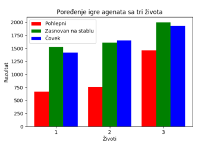

## 1. Uvod

* Veoma popularna igra **Pac-Man** je igra lavirinta u kojoj je cilj da igrač pojede svu hranu pri čemu beži od šarenih duhova koji ga jure

* Problem je rešavan iz dva ugla: ugla kretanja igrača i ugla kretanja neprijatelja

{ width=30%, height=30% }

## 2. Opis rešenja

### 2.1. Implementacija igre

* Slika lavirinta je mapirana u matricu ograničenja i tako je obezbeđeno kretanje igrača i duhova po željenim poljima  

{width=30%, height=30%}

## 2. Opis rešenja

### 2.2. Kretanje duhova

* Svaki od duhova ima svoj cilj do kog treba doći
* Za određivanje cilja, implementirani su algoritmi A* i Genetski algoritam

#### 2.2.1. A*

* Korišćen je graf sa jednakim težinama vrednosti 1, a kao heuristika je korišćeno Menhetn rastojanje 

## 2. Opis rešenja

#### 2.2.2. Genetski algoritam

* Jedinka je predstavljena kao putanja od naredna tri koraka 
* Funkcija prilagođavanja predstavljena je Menhetn rastojanjem
* Operatori:
    * turnirska selekcija 
    * jednopoziciono ukrštanje
    * mutacija zamenom slučajno odabranom akcijom iz skupa sa verovatnoćom 0.05
    * elitizam 10% populacije

## 2. Opis rešenja

### 2.3. Kretanje igrača

* Ideja  je bila kreiranje agenta koji igra približno ili bolje od prosečnog igrača
* Algoritmi koju su korišćeni su pohlepni algoritam, učenje potkrepljivanjem i agent zasnovan na stablima ponašanja

## 2. Opis rešenja

### 2.3.1.  Pohlepni agent

* Ovaj agent je implementiran da uz pomoć Menhetn rastojanja pronađe najkraći put do najbliže hrane
* Ukoliko postoje dve pilule na jednakim udaljenostima, uzima se ona koja je poslednja pronađena
* Očekivano, ovaj algoritam nije postigao previše dobre rezultate

## 2. Opis rešenja

### 2.3.2  Agent dobijen učenjem potkrepljivanjem

* Za ovo učenje postoji okuženje koje vraća nagradu agentu za neku akciju i sledeće stanje agenta

{width=30%, height=30%}

## 2. Opis rešenja

### 2.3.2  Agent dobijen učenjem potkrepljivanjem

* Skup akcija agenta je: {gore, dole, levo, desno}
* Nagrada se izračunava proverom da li igrač uhvaćen, da li je igrač pojeo hranu ili duha

{width=25%, height=25%}

* Za učenje je koršćena:
    * memorija od prethodnih deset hiljada stanja
	* epsilon pohlepna strategija za istraživanje
	    * u svakom koraku se obara parametar istraživanja sa 1 do minimalnih 0.1

## 2. Opis rešenja
### 2.3.3. Agent zasnovan na stablima ponašanja

* Ovaj agent prati zadati skup pravila
* Implementirano je stablo sa strukturom kao na sledećoj slici 
{width=30%, height=30%}

* Popravka ovog problema je urađena uz pomoć implementacije algoritma **grananje sa ograničavanjem** 
    * odluka gde agent da beži se simuliraju u naredna četiri koraka
* Za sledeći korak bira se najbolja pronađena putanja
* ukoliko na nekoj putanji agent bude pojeden, vrši se odsecanje

## 3. Ekspirimentalni rezultati

* Karakteristike računara na kojem su rađeni eksperimenti:
	* 4GB radne memorije
	* dvojezgarni procesor
	* operativni sistem KDE Neon
	* PyCharm integrisano razvojno okruženje za testiranje
	* Mreža je trenirana preko Google Colab platforme

## 3. Eksperimentalni rezultati

### 3.1. Kretanje duhova

#### Algoritam A*

* Duhovima je u proseku potrebno **oko 15 sekundi** da uhvate igrača koji se ne kreće
* Različiti ciljevi duhova su omogućili da duhovi uhvate igrača "u klopku"

#### Genetski algoritam

* Duhovima je potrebno u proseku **oko 20 sekundi** da uhvate igrača koji se ne kreće
	* uzimajući u obzir da se duhovi kreću i po nevalidnim poljima
* Algoritam je praktično neupotrebiv jer mu je potrebno previše vremena da iskonvergira ka pravoj putanji i da izračuna naredni korak

## 3. Eksperimentalni rezultati

### 3.2. Kretanje igrača

* Radi jednostavnosti, poređenja su vršena samo na jednom životu igrača
* Svi algoritmi su evaluirani protiv A* duhova
* Najlošiji rezultat očekivano ima pohlepni agent
* Ubedljivo najbolji rezultat daje agent zasnovan na stablu
* Agent treniran učenjem potkrepljenjem nije ispunio očekivanja
	* zaključak je da agent nije dovoljno treniran zbog ograničenja hardvera

{width=35%, height=35%}

## 4. Zaključak

* Iako na prvi pogled ne deluje, *Pac-Man* složena igra za rešavanje problema veštačke inteligencije, sa puno mogućih stanja
* A* pokazuje zaista odlične rezultate koji su veoma blizu optimalnih
	* stoga je bilo veoma teško napraviti agenta koji će igrati dobro protiv njih
* Učenje potkrepljivanjem trebalo bi da daje bolje rezultate nego što je eksperimentima utvrđeno
* Može se proglasiti da je agent zasnovan na stablu ponašanja odneo pobedu

## Kraj

### Hvala na pažnji!

## Literatura
* [Reinforcement learning in Pacman](http://cs229.stanford.edu/proj2017/final-reports/5241109.pdf)
* Vestačka inteligencija, Janičić Predrag i Nikolić Mladen
* Behavior Trees in Robotics and AI: An Introduction, Colledanchise, M. and Ögren, P.
* [Real-Time Monte-Carlo Tree Search in Ms Pac-Man](https://www.researchgate.net/publication/262836572_Real-Time_Monte-Carlo_Tree_Search_in_Ms_Pac-Man)
* Mašinsko učenje, Nikolić M. i Zečević A.
* Reactive control of Ms. Pac Man using information retrieval based on Genetic Programming, Brandstetter, M.F. and Ahmadi, S.
* [Playing Atari with Deep Reinforcement Learning](https://www.cs.toronto.edu/~vmnih/docs/dqn.pdf)
* [Proximal Policy Optimization Algorithms](https://arxiv.org/pdf/1707.06347.pdf)